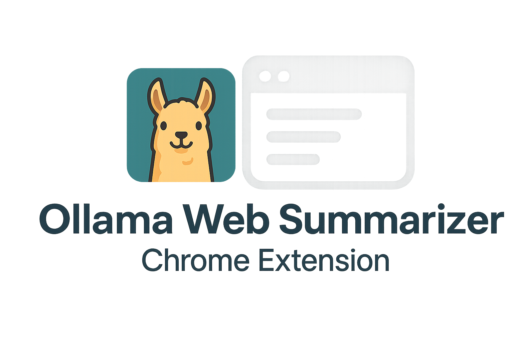

# Ollama Web Summarizer Chrome Extension



A Chrome extension that uses your local Ollama to summarize web content, explain concepts, and chat about it.

## Project Structure

```
ollama-ext/
├── manifest.json          # Extension manifest
├── README.md              # Main documentation
├── src/                   # Source code
│   ├── background.js      # Service worker for API calls
│   ├── content.js         # Content script for page interaction
│   ├── popup.html         # Extension popup UI
│   ├── popup.css          # Popup styles with theme support
│   └── popup.js           # Popup logic and theme system
├── icons/                 # Image assets
│   ├── background-llama.png
│   ├── llama-chat.png
│   ├── icon128.svg
│   └── Ollama-Summarizer.png
├── scripts/               # Helper scripts
│   ├── start-ollama.bat   # Windows Ollama startup
│   ├── start-ollama.sh    # Unix Ollama startup
│   └── create-icons.sh    # Icon generation script
└── docs/                  # Documentation
    └── INSTALLATION.md    # Detailed setup guide
```

## Features

- 📄 **Summarize any web page** - Click the extension to get instant summaries
- 💬 **Interactive chat** - Ask follow-up questions about the content
- ✨ **Text selection popup** - Highlight text to summarize, explain, or ask questions
- 🖱️ **Right-click context menu** - Quick access to AI features on any text
- ⚡ **Real-time streaming** - See responses as they're generated with "I'm thinking..." indicators
- 🔄 **Auto-detect models** - Automatically loads all your installed Ollama models into the dropdown
- 🎨 **12 themes** - Customize appearance with light/dark color schemes
- 🔒 **100% local** - All processing happens on your machine via Ollama
- 🚀 **No external API calls** - Complete privacy

## Prerequisites

- [Ollama](https://ollama.ai) installed and running locally
- At least one model installed:
  ```bash
  ollama pull llama3.2
  # Or any other model: mistral, qwen2.5, deepseek-r1, etc.
  ```

## Quick Install

### 1. Set CORS environment variable (one-time)
**Windows:** `[System.Environment]::SetEnvironmentVariable('OLLAMA_ORIGINS', '*', 'User')`  
**Mac/Linux:** `echo 'export OLLAMA_ORIGINS="*"' >> ~/.bashrc && source ~/.bashrc`

### 2. Install a model (if you haven't already)
```bash
ollama pull llama3.2
```

### 3. Start Ollama
```bash
ollama serve
```

### 4. Load extension
1. Chrome → `chrome://extensions/` → Enable "Developer mode"
2. Click "Load unpacked" → Select `ollama-ext` folder

**📖 For detailed setup instructions, see [INSTALLATION.md](docs/INSTALLATION.md)**

## Usage

1. Navigate to any webpage
2. Click the extension icon in your Chrome toolbar
3. Click "Summarize Page" to get a summary
4. Use the chat below to ask follow-up questions about the content

## Configuration

### Model Selection
The extension automatically detects all models installed in your Ollama instance by calling the `/api/tags` endpoint. The model dropdown will populate with your available models - no manual configuration needed!

**How it works:**
- On startup, the extension queries `http://localhost:11434/api/tags`
- All installed models (same as `ollama list`) appear in the dropdown
- Select any model to use it for summarization and chat
- Your selection is saved for future sessions

**To add more models:**
```bash
ollama pull llama3.2
ollama pull mistral
ollama pull deepseek-r1
```

Reload the extension and the new models will appear in the dropdown.

### Themes
Choose from 12 color themes (6 light, 6 dark) in the theme dropdown. Your preference is saved automatically.

## Quick Troubleshooting

| Error | Solution |
|-------|----------|
| **403 Forbidden** | Set `OLLAMA_ORIGINS="*"` environment variable (see install step 1) |
| **404 Model not found** | Run `ollama pull <model-name>` or select different model |
| **Connection Error** | Start Ollama with `ollama serve` |
| **Empty model dropdown** | Ensure Ollama is running and has models (`ollama list`) |

**📖 For complete troubleshooting guide, see [INSTALLATION.md](docs/INSTALLATION.md)**
